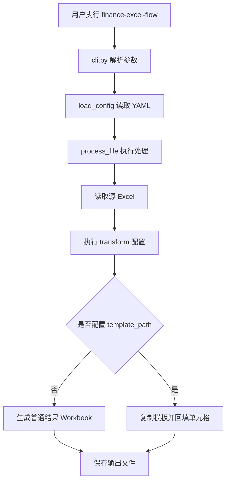

# finance-excel-flow 项目设计文档

## 1. 项目定位

`finance-excel-flow` 是一个面向财务月度 Excel 文件处理的可配置自动化工具。项目目标是把重复、固定规则的 Excel 手工处理流程沉淀为配置文件和模板文件，用户每月只需要替换源 Excel，即可生成标准化输出文件。

当前项目支持两类主要使用场景：

1. 通用 Excel 清洗转换：读取源 Excel，按 YAML 配置执行列重命名、必填列校验、行过滤、计算列、排序、列选择，然后导出新的 Excel。
2. 财务模板回填：复制固定 Excel 模板，按业务规则筛选源数据、汇总金额、计算 accrual 金额，并把结果写入指定单元格，保留模板原有样式和版式。

## 2. 技术栈与运行形态

| 类别 | 设计 |
| --- | --- |
| 语言 | Python 3.10+ |
| Excel 读写 | `openpyxl` |
| 配置解析 | `PyYAML` |
| 命令行入口 | `argparse` + `finance-excel-flow` console script |
| 打包方向 | PyInstaller spec + Windows `.bat` / `.command` 运行入口 |
| 测试 | `unittest` |

项目采用 `src/` 布局，核心包为 `finance_excel_flow`。

## 3. 目录结构与模块职责

```text
finance-data/
├── src/finance_excel_flow/
│   ├── cli.py          # 标准命令行入口
│   ├── config.py       # YAML 配置模型与加载校验
│   ├── engine.py       # Excel 读取、转换、业务规则计算与输出核心
│   ├── paths.py        # 开发/打包环境下资源路径解析
│   ├── console.py      # Windows 控制台 UTF-8 处理
│   └── __main__.py     # python -m finance_excel_flow 入口
├── scripts/
│   ├── run.py          # 面向最终用户的一键运行入口
│   └── build_windows.bat
├── configs/
│   ├── example.yml            # 通用清洗转换配置示例
│   └── template-example.yml   # 模板回填配置示例
├── tests/
│   └── test_config.py
├── pyproject.toml
├── requirements.txt
└── finance-data.spec
```

核心职责边界：

- `config.py` 只负责把 YAML 转换为强类型 dataclass 配置，并做基础结构校验。
- `engine.py` 负责所有业务执行逻辑，包括读取 Excel、表达式求值、数据转换、业务规则汇总和写文件。
- `cli.py` 负责命令行参数解析，不直接包含业务逻辑。
- `scripts/run.py` 面向非技术使用者，自动选择 `inputs/` 中最新 Excel，并使用内置配置生成输出。
- `paths.py` 屏蔽开发环境和 PyInstaller 打包环境的资源路径差异。

## 4. 总体处理流程

### 4.1 命令行模式



### 4.2 一键运行模式

`scripts/run.py` 设计给业务用户使用：

1. 自动创建 `inputs/` 和 `output/` 目录。
2. 从 `inputs/` 中寻找最新的 `.xlsx` / `.xlsm` 文件，忽略 Excel 临时文件 `~$*`。
3. 固定读取 `configs/template-example.yml`。
4. 调用 `process_file()` 生成输出。
5. 将常见异常转换成中文提示，例如缺少文件、缺少列、工作表不存在、数值格式错误、文件被 Excel 占用等。

## 5. 配置模型设计

配置入口为 `AppConfig`，由四部分组成：

| 配置段 | dataclass | 作用 |
| --- | --- | --- |
| `input` | `InputConfig` | 指定源 Excel 工作表和表头行 |
| `output` | `OutputConfig` | 指定输出 sheet、文件名模板、模板路径和输出格式行为 |
| `transform` | `TransformConfig` | 定义通用清洗转换规则 |
| `business_rules` | `BusinessRuleConfig[]` | 定义模板回填模式下的财务汇总和单元格映射规则 |

### 5.1 input

```yaml
input:
  sheet_name: Detail
  header_row: 1
```

- `sheet_name` 支持 sheet 名称、sheet 下标或 `null`。下标模式使用 `openpyxl` 的工作表列表索引。
- `header_row` 从 1 开始，用于读取表头。

### 5.2 output

```yaml
output:
  sheet_name: "Sheet1"
  filename_template: "{source_stem}_{yyyymmdd}.xlsx"
  template_path: "templates/ka_promo_and_expense_template.xlsx"
  freeze_header: false
  auto_fit_columns: false
```

输出文件名模板支持：

- `{source_stem}`
- `{source_name}`
- `{source_suffix}`
- `{date}`
- `{datetime}`
- `{yyyymmdd}`
- `{yyyymm}`
- `{timestamp}`

如果指定 `template_path`，进入模板回填模式；否则进入普通结果导出模式。

### 5.3 transform

```yaml
transform:
  rename_columns:
    原始销售额: 销售额
  required_columns:
    - 销售额
  drop_empty_rows: true
  filters:
    - 'num("销售额") > 0'
  calculated_columns:
    毛利: 'num("销售额") - num("成本")'
  select_columns:
    - 销售额
    - 毛利
  sort_by:
    - 销售额
```

执行顺序固定为：

1. 读取源 Excel。
2. 删除空行。
3. 重命名列。
4. 校验必填列。
5. 应用行过滤。
6. 计算新列。
7. 排序。
8. 选择输出列。
9. 写入普通结果文件。

注意：模板回填模式当前使用原始 `source_rows` 执行业务规则，而不是 transform 之后的 `rows`。这意味着 `business_rules.source_filters` 应使用源 Excel 的原始列名。

## 6. 表达式机制设计

项目使用配置中的字符串表达式描述筛选和计算逻辑，由 `engine._evaluate()` 执行。执行时禁用 `__builtins__`，只开放有限 helper。

### 6.1 行级表达式上下文

用于 `transform.filters`、`transform.calculated_columns` 和 `business_rules.source_filters`。

| helper | 作用 |
| --- | --- |
| `col("列名", default=None)` | 读取原始单元格值 |
| `text("列名", default="")` | 读取文本，空值返回默认值 |
| `num("列名", default=0)` | 读取数值并转换为 `Decimal` |
| `date("列名", default=None)` | 解析日期 |
| `ifnull(value, default="")` | 空值兜底 |
| `contains("列名", needle)` | 文本包含判断 |
| `startswith("列名", prefix)` | 文本前缀判断 |
| `endswith("列名", suffix)` | 文本后缀判断 |
| `lit(value)` | 返回字面量 |
| `round` | Python `round` |
| `Decimal` | `decimal.Decimal` |

示例：

```yaml
filters:
  - 'text("Customer number") == "0178"'
  - 'num("Due Amount") >= 0'
  - 'text("Brand") in ("000030", "000050")'
```

### 6.2 业务规则表达式上下文

用于 `template_cells` 和 `summary_template_cells`，上下文来自业务汇总结果。常见字段包括：

| 字段 | 含义 |
| --- | --- |
| `rule_name` | 当前规则名称 |
| `matched_count` | 命中明细行数 |
| `source_yyyymm` | 从源文件名提取的年月，匹配 `20xxxx` |
| `run_yyyymm` | 当前运行年月 |
| `due_amount_total` | 命中明细的金额合计 |
| `percentage` | 当前规则比例 |
| `accrual_amount` | `due_amount_total * percentage` |
| `name` | `name_template` 渲染后的名称 |
| `group_index` | 分组序号 |
| `row` / `credit_row` | 分组规则指定的输出行号 |
| `group_key` | 分组键 |
| 分组字段别名 | 例如 `Brand` 会生成 `brand` |

示例：

```yaml
template_cells:
  E{row}: 'lit("0178")'
  F{row}: 'brand'
  I{row}: 'round(accrual_amount, 2)'
  J{row}: 'name'
```

## 7. 普通 Excel 输出设计

普通输出模式由 `_write_output()` 实现：

1. 新建 `Workbook`。
2. 写入表头。
3. 按表头顺序写入每一行。
4. 可选冻结首行，默认开启。
5. 表头加粗。
6. 可选自动列宽，默认开启，最大宽度限制为 60。
7. 创建输出目录并保存。

这种模式适合输出扁平化明细或清洗后的数据表。

## 8. 模板回填设计

模板回填模式由 `_write_template_output()` 实现，设计重点是保留 Excel 模板原有格式。

### 8.1 基本规则

每条 `business_rule` 的执行流程：

1. 使用 `source_filters` 从源数据中过滤命中行。
2. 对 `sum_field` 求和。
3. 使用 `percentage` 计算 `accrual_amount`。
4. 使用源文件名提取 `source_yyyymm`。
5. 使用 `name_template` 生成业务名称。
6. 对 `template_cells` 中的每个单元格表达式求值并写入模板。

### 8.2 分组规则

如果配置了 `group_by`，规则会按字段分组汇总：

```yaml
group_by:
  - Brand
group_row_pairs:
  - [68, 68]
  - [69, 69]
group_percentages:
  "000030": 0.10
  "000050": 0.08
```

设计行为：

- `group_by` 为空时，整条规则只产生一个汇总。
- `group_by` 非空时，每个分组产生一组 summary。
- `group_row_pairs` 用于把分组结果绑定到模板中的行号。
- 如果分组数量超过 `group_row_pairs` 数量，会抛出错误，避免静默漏写。
- `group_percentages` 支持按分组值覆盖默认 `percentage`。
- 单字段分组时会额外提供 `group_value` 和字段别名，例如 `Brand` -> `brand`。

### 8.3 汇总单元格

`summary_template_cells` 用于写入跨分组汇总结果：

```yaml
summary_template_cells:
  I66: 'round(total_accrual_amount, 2)'
  L66: 'round(total_due_amount_total, 2)'
```

可用字段包括：

- `total_due_amount_total`
- `total_accrual_amount`
- `matched_count`
- `source_yyyymm`
- `run_yyyymm`
- `name`

## 9. 路径与打包设计

`paths.py` 通过 `sys.frozen` 判断运行环境：

- 开发环境：项目根目录为 `src/finance_excel_flow` 向上两级。
- 打包环境：应用根目录为 `sys.executable` 所在目录。
- PyInstaller 资源目录：读取 `sys._MEIPASS`。

`resolve_bundle_path()` 允许配置中写相对路径，例如：

```yaml
template_path: templates/ka_promo_and_expense_template.xlsx
```

开发运行时会解析到项目根目录下的模板；打包后会解析到 PyInstaller 内置资源目录。

## 10. 错误处理设计

底层模块以抛出异常为主：

- 配置结构错误：`ValueError`
- 缺少必填列：`ValueError`
- 工作表不存在：来自 `openpyxl`
- 数值转换失败：`ValueError`
- 输出文件占用或无权限：系统异常

`scripts/run.py` 在最终用户入口处将常见异常转换为中文业务提示，降低使用门槛。标准 CLI 保留原始异常栈，更适合开发和排查。

## 11. 测试设计

当前测试集中在 `tests/test_config.py`：

1. 验证 YAML 能正确加载为 dataclass。
2. 验证输出文件名模板渲染。
3. 构造临时源 Excel 和模板配置，验证模板回填模式的核心单元格输出。

测试覆盖了单规则、重复写入、多客户、多品牌、分组汇总、分组行映射和汇总单元格等关键路径。

## 12. 当前设计取舍

### 12.1 配置优先

业务规则尽量放在 YAML 中，而不是硬编码在 Python 中。这降低了每月调整规则时的开发成本。

代价是 YAML 表达式的可读性和调试体验依赖维护者能力。对于复杂规则，应优先补测试，避免仅凭人工检查配置。

### 12.2 使用 `eval` 执行表达式

项目通过禁用 `__builtins__` 并限制上下文来降低风险，但 `eval` 仍然意味着配置文件必须视为可信输入。当前设计适合内部受控配置，不适合作为开放给外部用户上传任意 YAML 的服务端能力。

### 12.3 模板模式不复用 transform 后数据

模板回填使用原始行数据，避免列重命名或列筛选影响模板业务规则。这使模板配置更贴近源 Excel，但也要求规则里使用原始列名。

如果后续希望模板规则复用标准化列名，需要明确引入“模板规则基于 transform 后数据”的配置开关。

## 13. 可扩展方向

建议按以下顺序扩展：

1. 增加配置 schema 校验和更明确的错误位置提示。
2. 为表达式求值增加配置预检查，提前发现列名拼写错误。
3. 拆分 `engine.py`：读取、转换、表达式、模板写入、业务规则汇总可拆成独立模块。
4. 增加 dry-run / preview 模式，输出每条 business rule 的命中行数、汇总金额和目标单元格。
5. 增加多文件批处理能力。
6. 增加多 sheet 输出能力。
7. 增加日志文件，便于业务用户把失败信息发给维护者。

## 14. 维护建议

- 每新增或修改一组 `business_rules`，至少补充一个小型 Excel 样例测试，验证关键单元格。
- 对金额计算继续使用 `Decimal`，避免浮点误差影响财务结果。
- 模板单元格位置变更时，应同时更新配置和测试断言。
- 不建议把复杂业务判断写成过长表达式；复杂规则应考虑在代码中新增 helper，并通过配置调用。
- 打包前应执行单元测试，并手工用一份真实结构的源 Excel 验证输出模板。
